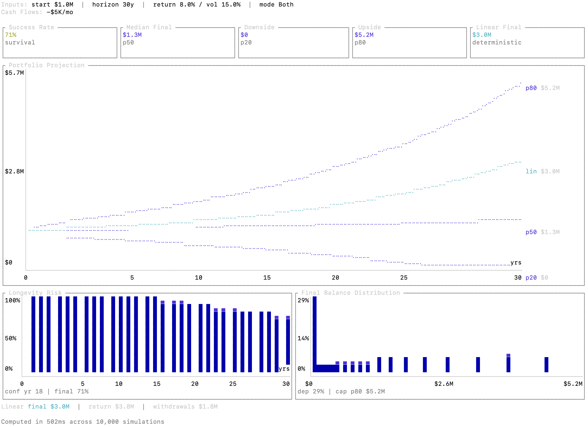

<p align="center">
  
</p>

<p align="center">
  <a href="https://github.com/Entropy-Financial-Technologies/entropyfa-cli/actions/workflows/ci.yml"></a>
  <a href="https://github.com/Entropy-Financial-Technologies/entropyfa-cli/releases/latest"></a>
  <a href="LICENSE-MIT"></a>
</p>

<p align="center">Personal finance and wealth planning engine for AI agents.<br>Verified federal reference data with deterministic tax, retirement, and estate calculations — local by default, sub-ms, JSON-in/JSON-out.</p>

**Why?** Financial planning agents need two things they can't do well on their own: (1) verified reference data — rates, limits, rules, tables that change annually and must be IRS-sourced, not hallucinated, and (2) deterministic calculations — tax bracket stacking, actuarial math, Monte Carlo simulations. entropyfa bundles both into a single binary with zero configuration.

**Current scope:** Full reviewed 2026 federal reference data, plus reviewed 2025 federal ordinary income tax brackets for `data lookup`. Federal tax and estate calculations, SALT-aware itemized deduction support, retirement/RMD rules, Roth conversion analysis, pension comparison, Monte Carlo projection, and goal solving all currently default to 2026. State tax/reference data is not shipped yet.

## 30-Second Demo

```sh
# What data is available?
entropyfa data coverage

# Look up 2026 federal income tax brackets
entropyfa data lookup --category tax --key federal_income_tax_brackets --filing-status single

# Look up 2025 federal income tax brackets
entropyfa data lookup --category tax --key federal_income_tax_brackets --year 2025 --filing-status single

# Compute federal tax
entropyfa compute federal-tax --json '{"filing_status":"single","income":{"wages":150000}}'

# What does this command need?
entropyfa compute roth-conversion --schema

# Run a Roth conversion analysis
entropyfa compute roth-conversion --json '{"filing_status":"married_filing_jointly","income":{"wages":200000},"conversion_amount":50000}'

# Monte Carlo retirement projection
entropyfa compute projection --json '{"starting_balance":1000000,"time_horizon_months":360,"return_assumption":{"annual_mean":0.07,"annual_std_dev":0.15},"cash_flows":[{"amount":-4000,"frequency":"monthly"}]}'

# Bucketed household projection
entropyfa compute projection --json '{"buckets":[{"id":"taxable","bucket_type":"taxable","starting_balance":600000,"return_assumption":{"annual_mean":0.07,"annual_std_dev":0.15},"realized_gain_ratio":0.25},{"id":"ira","bucket_type":"tax_deferred","starting_balance":400000,"return_assumption":{"annual_mean":0.06,"annual_std_dev":0.10}}],"spending_policy":{"withdrawal_order":["taxable","ira"]},"time_horizon_months":360,"cash_flows":[{"amount":-4000,"frequency":"monthly"}]}'

# Add a terminal dashboard when you actually want the visual
entropyfa compute projection --visual --json '{"starting_balance":1000000,"time_horizon_months":360,"return_assumption":{"annual_mean":0.07,"annual_std_dev":0.15},"cash_flows":[{"amount":-4000,"frequency":"monthly"}]}'

```

### Monte Carlo Projection Dashboard

<p align="center">
  
</p>

See [docs/compute-visuals.md](docs/compute-visuals.md) for how the projection dashboard works, why it is opt-in, and how it relates to the JSON output.

`compute projection` accepts both legacy aggregate inputs and bucketed household inputs. Bucketed requests can also supply `spending_policy`, `tax_policy`, and `rmd_policy`. The terminal dashboard remains aggregate-only for now, so it does not render per-bucket charts yet.

Annual household federal tax uses embedded data when available; once supported years are exhausted, modeled tax settings apply.

For bucketed runs, set `filing_status` when annual household tax matters, and set `household.birth_years` plus `household.retirement_month` when RMD behavior matters.

## Install

**Quick install** (macOS / Linux):

```sh
curl -fsSL https://get.entropyfa.com | sh
```

This installs `entropyfa` into `~/.entropyfa/bin` by default and updates your shell profile if that directory is not already on `PATH`.

**System-wide install** (optional):

```sh
curl -fsSL https://get.entropyfa.com | sh -s -- --system
```

**Cargo**:

```sh
cargo install --git https://github.com/Entropy-Financial-Technologies/entropyfa-cli.git entropyfa
```

**From source**:

```sh
git clone https://github.com/Entropy-Financial-Technologies/entropyfa-cli.git
cd entropyfa-cli
cargo build --release
mkdir -p ~/.entropyfa/bin
install -m 755 target/release/entropyfa ~/.entropyfa/bin/entropyfa
```

## OpenClaw

The official OpenClaw skill is:

- package slug: `entropyfa`
- display name: `entropyFA Financial Planning`
- description: `Verified financial planning data and blazing-fast, deterministic calculators for Monte Carlo projection, goal solving, Roth conversions, RMDs, income tax, estate tax, and pension analysis.`

Install it into your current OpenClaw workspace with:

```sh
clawhub install entropyfa
```

See [docs/openclaw.md](docs/openclaw.md) for prerequisites, local workspace install, example prompts, and trust guidance. The skill source lives in [integrations/openclaw/entropyfa](integrations/openclaw/entropyfa).

## Upgrade

```sh
entropyfa upgrade
```

This checks GitHub for the latest release, downloads the new binary for your platform, and replaces the current executable when that path is writable. If your existing install lives in a system directory such as `/usr/local/bin` and is not writable, `upgrade` installs the new binary to `~/.entropyfa/bin` instead of prompting for `sudo`. The CLI also checks for updates in the background — if a newer version is available, you'll see a reminder on stderr.

`entropyfa update` is supported as an alias for the same self-update flow.

## Commands

### Data

| Command | Description |
|---------|-------------|
| `data lookup` | Look up specific reference data by category, key, year, and filing status |
| `data coverage` | Discover all available reference data |

### Compute

| Command | Description |
|---------|-------------|
| `compute federal-tax` | Federal income + payroll taxes |
| `compute estate-tax` | Federal estate tax (Form 706) |
| `compute rmd` | Required minimum distribution for a single year |
| `compute rmd-schedule` | Multi-year RMD projection |
| `compute roth-conversion` | Roth conversion tax impact analysis |
| `compute roth-conversion-strategy` | Multi-year Roth conversion strategy |
| `compute pension-comparison` | Pension lump sum vs annuity comparison |
| `compute projection` | Monte Carlo / linear projection |
| `compute goal-solver` | Binary search goal solver |

Every compute command supports `--schema` to emit agent-oriented guidance: what inputs are needed, what to gather from the user, why to use this command, and related commands.

All commands emit a JSON envelope to `stdout`. If `--result-hook-url` is set, entropyfa also POSTs the same envelope to your webhook endpoint as a best-effort side effect.

Tax-oriented compute flows accept either aggregate `deductions.itemized_amount` or detailed Schedule A-style inputs such as `deductions.state_local_income_or_sales_tax`, `deductions.real_property_tax`, `deductions.personal_property_tax`, and `deductions.other_itemized_deductions`.

## Embedded Data Sources

Embedded reference data is compiled into the binary, and `data lookup` returns source URLs by default.

See [docs/embedded-data.md](docs/embedded-data.md) for every supported key, required params, and example lookup responses from the current reviewed dataset.

- **Tax brackets** -- federal income tax rates by filing status (Rev. Proc.)
- **Standard deductions** -- standard deduction amounts by filing status
- **SALT deduction parameters** -- federal Schedule A SALT cap, phaseout, and floor by filing status
- **Capital gains brackets** -- 0%/15%/20% thresholds by filing status
- **Estate tax** -- exemption amount and rate schedule
- **NIIT** -- net investment income tax thresholds
- **Payroll rates** -- Social Security wage base, Medicare rates, and Additional Medicare thresholds
- **QBI thresholds** -- qualified business income deduction phase-in ranges
- **RMD tables** -- Uniform Lifetime, Joint Life, Single Life Expectancy
- **IRMAA brackets** -- Medicare Part B/D income-related surcharges
- **Medicare base premiums** -- Medicare Part B standard premium, Part B deductible, and Part D base beneficiary premium
- **SS full retirement age rules** -- Social Security retirement and spousal FRA table by birth year
- **SS taxation thresholds** -- Social Security benefit taxation thresholds by filing status
- **417(e) mortality tables** -- Section 417(e) mortality rates for pension lump-sum work

## How Reference Data Is Verified

The embedded data is not hand-waved into the binary. Each yearly entry goes through a review pipeline before it becomes part of a release.

The current process is:

1. A primary agent pass gathers the official values, extracts the proposed payload, and cites exact source URLs and locators.
2. A separate verifier agent independently checks the same entry against the cited sources and flags disagreements, source-policy issues, or contract mismatches.
3. A human reviews the generated evidence packet before approval.
4. Only approved runs are applied back into the reviewed artifact, generated Rust source, metadata, and snapshot.

In the current maintainer workflow, `run-agents` defaults to Claude `claude-opus-4-6` for the primary pass and Codex `gpt-5.4` for the verifier pass, but the important design choice is the independent two-pass review, not any one model name.

Accepted sources are controlled by per-entry source policy. For entries with a clear federal publisher, authoritative status requires an accepted official source on an approved host such as `irs.gov`, `cms.gov`, or `ssa.gov`. Supporting and secondary sources can corroborate the result, but they do not silently replace the primary official source requirement.

The lookup output reflects that provenance directly:

- `verification_status` shows the current trust status
- `pipeline_reviewed` shows whether the current embedded value came through the verification pipeline
- `sources` returns the source URLs and metadata used for the reviewed entry

## Documentation

The docs are split by audience:

- **User docs** — [docs/embedded-data.md](docs/embedded-data.md) for the embedded reference-data surface and example `data lookup` responses
- **User docs** — [docs/compute-visuals.md](docs/compute-visuals.md) for terminal dashboard behavior and chart-like compute output
- **User docs** — [docs/openclaw.md](docs/openclaw.md) for the official OpenClaw skill and install/usage guidance
- **Maintainer docs** — [docs/data-pipeline.md](docs/data-pipeline.md) for the contributor workflow that verifies, reviews, and applies yearly data updates
- **Maintainer docs** — [docs/roadmap.md](docs/roadmap.md) for the domain, product, and pipeline roadmap beyond the current federal tax/RMD surface
- **Docs index** — [docs/README.md](docs/README.md) for a simple entry point inside the `docs/` folder

## Feedback

For product feedback, bug reports, or questions:

- email `dan@entropyfa.com`
- message [@entropyfa](https://x.com/entropyfa) on X

## Designed for Agents

entropyfa is designed as a tool for AI agents doing financial planning:

- **`--schema` on every command** -- agents read the schema to know what inputs to gather from the user, why to use a command, and what related commands exist
- **`data coverage`** -- agents discover what reference data is available without hardcoding keys
- **JSON-in/JSON-out** -- structured I/O that agents parse natively
- **Human output on stderr** -- dashboards, warnings, and upgrade notices stay off the machine-readable stdout channel
- **Deterministic** -- same input always produces the same output, so agents can reason about results
- **No configuration** -- install and go, no API keys, no config files, and no outbound calls unless you opt into `upgrade` / `update` or `--result-hook-url`

Works with OpenClaw, Claude tool use, OpenAI function calling, LangChain, or plain shell exec.

## Architecture

```
--json '<JSON>' / flags --> entropyfa CLI --> entropyfa-engine --> stdout (JSON envelope)
                                         \
                                          --> stderr (dashboard / warnings)
                                         \
                                          --> optional webhook POST
```

- **Local by default** -- all reference data is compiled into the binary; outbound calls are opt-in
- **Sub-millisecond** -- pure computation, no I/O overhead
- **Single binary** -- no runtime dependencies
- **Monthly releases** -- updated when IRS publishes new data

The project is a Cargo workspace with two crates:

| Crate | Purpose |
|-------|---------|
| `engine` | Embedded IRS reference data + computation logic (usable as a Rust library) |
| `cli` | CLI that accepts JSON via `--json` flag, assembles compute requests with embedded data, writes JSON to stdout, and can optionally POST result envelopes |

## Disclaimer

entropyfa is a computation tool, not financial advice. Tax laws are complex and change frequently. Always verify results against primary IRS sources and consult a qualified tax professional before making financial decisions. The authors and contributors accept no liability for decisions made based on this tool's output.

## License

Dual-licensed under [MIT](LICENSE-MIT) or [Apache-2.0](LICENSE-APACHE), at your option.
